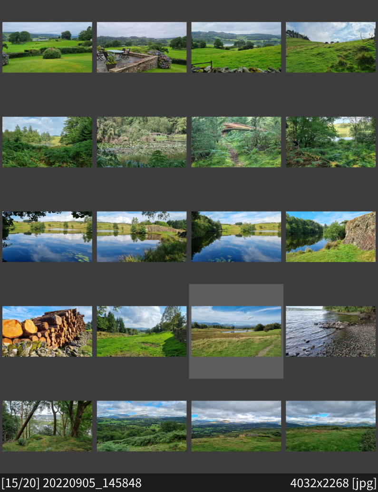
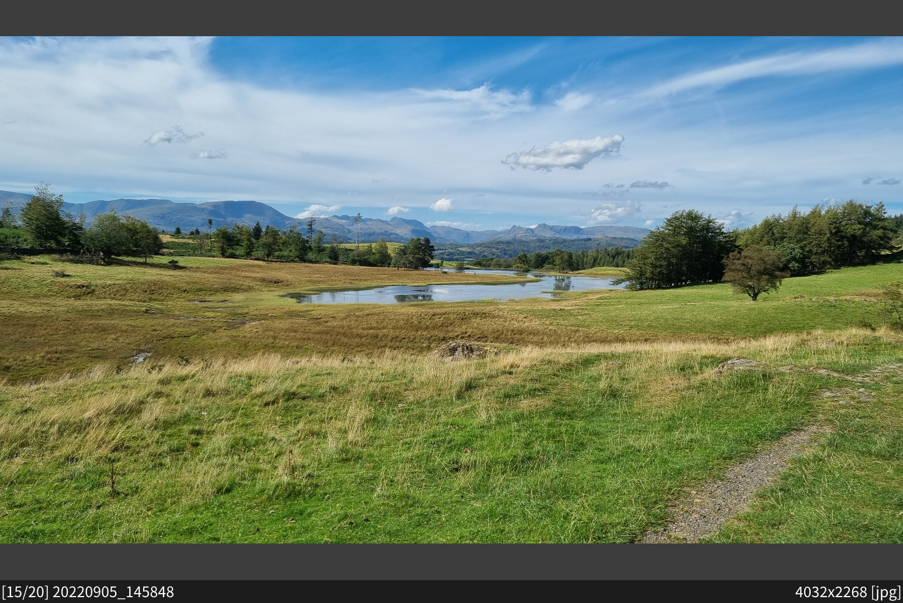

# rlens
A lightweight, scriptable image viewer written in Rust.

### Usage
Run rlens with a list of image paths.\
`rlens a.png b.jpg c.webp`

Alternatively, paths can be provided by stdin.\
`find -type f | rlens` will open all the files in the current directory.

### Features
* Wide support of image formats (see [image-rs](https://github.com/image-rs/image#supported-image-formats))
* Basic image manipulation (pan, zoom, rotate, flip)
* A gallery of thumbnails for browsing
* Preloading of surrounding images
* A scriptable status bar
* [lua](https://www.lua.org/) based configuration
* Cross-platform (including Wayland)

#### Future
* Simple command line for interacting with rlens without keybinds (e.g. `:goto 4`)
* Slideshow

#### Not provided
* Animation support - When viewing animated image files rlens shows only the first frame

### Screenshots

 

### Configuration
rlens is configured by two files:
* `config.toml`: A toml file specifying settings required on startup
* `rc.lua`: A lua file for runtime configuration, including keybinds

These files are searched for in the config directory, which can be set by the command-line option `--config-dir`, or the environment variable `RLENS_CONFIG_DIR`.\
If neither are set a system default is used (`~/.config/rlens/`, `$HOME/Library/Application Support/rlens`, or `...\AppData\Roaming\rlens\config`).

To get started you'll need the default configuration.
Copy the contents of [this directory](../config) to your chosen config directory and rlens will be ready to use. See the [README](../config/README.md) for a list of the set keybinds.

If you want to edit the rc, or script your own extensions to rlens, you'll want to read the [lua API reference](api.md).

### rlens-folder
A small python utility is provided for opening all the images in a file's directory, starting at that file.\
`rlens-folder images/b.jpg` will run `rlens --start-at 2 a.png b.jpg c.webp`.

This is intended to be used as the default image opener for file explorers, for more smoothly browsing a folder of images.

### Building

Build rlens with [`cargo`](https://www.rust-lang.org/tools/install) from the project root:
```
cargo install --path . --features builtin-lua54
```

#### lua

rlens requires a copy of lua to run.\
To determine the source and version, of one of the following features must be specified: `builtin-lua54`, `builtin-lua53`, `builtin-lua51`, `system-lua54`, `system-lua53`, `system-lua51`.

The `builtin-lua*` options locally build and embed lua into rlens, and as such require a `C` compiler to be present on the system.\
The `system-lua*` options link to an installed copy of lua, and require `pkg-config` to search for it.

For example, to link to a system copy of lua v5.4:
```
cargo install --path . --features system-lua54
```

#### Embedded font

By default, a copy of [noto sans](https://fonts.google.com/noto/specimen/Noto+Sans) is embedded into rlens.
You can disable this by using the `--no-default-features` flag.\
For example:
```
cargo install --path . --features builtin-lua54 --no-default-features
```
Note that it will then be required to specify a local font in `config.toml`:
```
[font]
path = '...'
```

